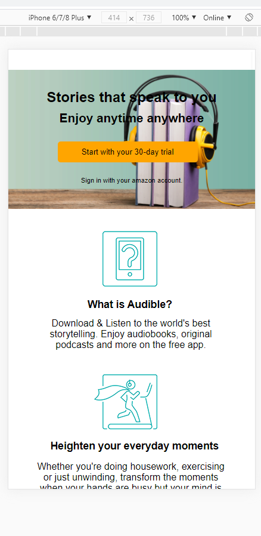

# Procesverslag
**Auteur:** -jouw naam-

Markdown cheat cheet: [Hulp bij het schrijven van Markdown](https://github.com/adam-p/markdown-here/wiki/Markdown-Cheatsheet). Nb. de standaardstructuur en de spartaanse opmaak zijn helemaal prima. Het gaat om de inhoud van je procesverslag. Besteedt de tijd voor pracht en praal aan je website.

## Bronnenlijst
1. https://dev.to/ljcdev/easy-hamburger-menu-with-js-2do0
2. Inleiding programmeren (vorig schooljaar)
3. Audible website (afbeeldingen & content)

## Eindgesprek (week 7/8)

In de herfstvakantie heb ik de media query code verwijderd en de opdrachten opnieuw gemaakt. Daardoor begreep ik het beter en besloot ik weer te beginnen met het responsive. 

Lastig: Responsive maken. Dit nam veel tijd in beslag omdat ik een paar (typ)fouten maakte. Ik was vergeten om max-width te gebruiken. Daardoor was alle content verspreid over de scherm.

Daarnaast had ik ook moeite met Javascript. Ik was vergeten wat ik allemaal moest doen maar doordat ik naar m'n werk van Inleiding Programmeren keek en de opdrachten van vorig jaar, lukte het mij wel om de interacties te laten werken.

Ik heb wel een probleem met het linken van de tweede pagina naar 1 Css & Javascript. 1) De hamburger menu werkte niet meer toen ik de tweede pagina linkte met javascript. 2) Ik heb de tweede html pagina gelinkt naar de css, maar sommige dingen bleven hetzelfde toen ik de code had aangepast: de width van de afbeeldingen veranderden niet op de tweede pagina maar de kleur van h2 wel. 

**Screenshot(s):**
Mobiele versie pagina 2. Ik heb een 2 grid column gebruikt en als de width verandert, gaat het naar 3 grid en 4 grid.

Mobiele versie pagina 1.

## Voortgang 3 (week 6)

### Agenda voor meeting

- Algemene feedback voor eigen code

### Stand van zaken
Lastig: het maken van een hamburger menu. Het lukte niet om Javascript toe te passen. 

## Voortgang 2 (week 5)
### Stand van zaken
Wat ging goed & Slecht?
Deze week heb ik weinig content toegevoegd dus m'n website is hetzelfde gebleven (visueel). Na het eerste feedbackgesprek heb ik meer tijd gefocust om de code te begrijpen en toe te passen. Ik heb de opdrachten over flexbox opnieuw gemaakt en ben ik gaan verdiepen op grid en media queries. Ook heb ik de Html en CSS code verbeterd en overzichtelijker gemaakt. Ik merkte dat ik veel fouten maakte omdat ik niet wist waar sommige codes waren. 

### Agenda voor meeting
- Hamburger menu
- Knoppen die de afbeeldingen veranderen (m.b.v. Javascript)

## Voortgang 1 (week 3)

### Stand van zaken
Wat ging goed & Slecht?

Slecht: Ik had eerst moeite met het verplaatsen van elementen in css. Daardoor liep ik een beetje achter met het maken van m'n website maar uiteindelijk is het mij wel gelukt omdat ik de opdrachten van absolute/relative position opnieuw heb gemaakt.

Na het voorgangsgesprek ga ik de feedback verwerken en nog de laatste dingen toevoegen aan de eerste pagina: nav & footer. 
Daarna wil ik gaan focussen op het responsive maken van de site en een interactie toevoegen met behulp van javascript.

**Screenshot(s):**

-screenshot(s) van hoe ver je bent-

### Agenda voor meeting

- dingen naast elkaar zetten. 
- Hoe kun je makkelijker zien nth gebeuren
- Mag je classes  gebruiken
- Moet je hamburger laten werken? 
- Hoe zet je het om in een hamburgermenu
- flexbox vragen, naast elkaar zetten bijvoorbeeld.

## Intake (week 1)

**Je startniveau:** Rode Piste ("Je kunt het wel, maar doordat je het te weinig doet, roest je. Als het lukt, is coderen stiekem best leuk")

**Je focus:** Responsive

**Je opdracht:** https://www.audible.co.uk/

**Screenshot(s):**

**Breakdown-schets(en):**

